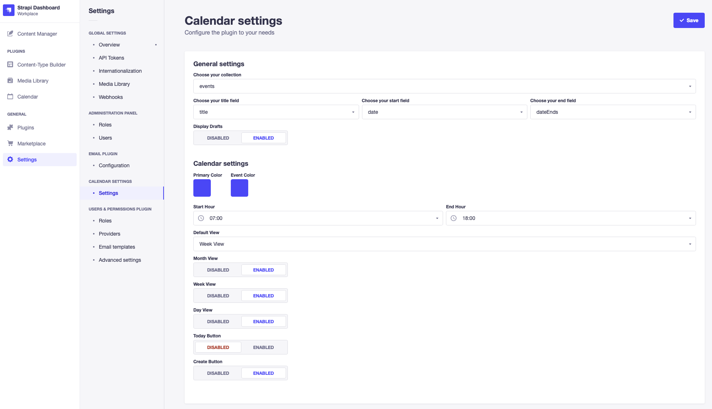

<p align="center">
  
</p>
<h1 align="center">Strapi Plugin Calendar</h1>
<p align="center">
  <a href="https://badge.fury.io/js/@offset-dev%2Fstrapi-calendar" target="_blank">
    
  </a>
  <a href="https://github.com/offset-dev/strapi-calendar/actions/workflows/publish.yml" target="_blank">
    
  </a>
  <a href="https://github.com/offset-dev/strapi-calendar/actions/workflows/lint.yml" target="_blank">
    
  </a>

> Visualize your content in a map with month, weekly and daily view.
> [View on Strapi Marketplace](https://market.strapi.io/plugins/@offset-dev-strapi-calendar)
  

</p>

## Demo

[](https://www.loom.com/share/18712a97afa742ed8a7a57136d85c218)

## How to Install

Copy the following code and run from your terminal

```
yarn add @offset-dev/strapi-calendar
```

## How to Use

Open the settings page and select the calendar settings.



Here you can select which collection and fields to use.
You can also customize the calendar style and options.
